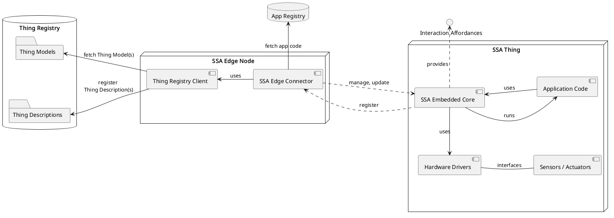

# Smart Sensor Actuator

## Architecture Overview

The **Smart Sensor Actuator (SSA)** project builds on the **W3C Web of Things (WoT)** standard and proposes a **Thing Model (TM)** centric
framework for large-scale (I)IoT deployments.

The SSA architecture has two main components: the _Embedded Core_ and the _Edge Connector_.
- The Smart Sensor Actuator Embedded Core (SSA-EmbC) outlines a platform-agnostic interaction model and API for IoT end devices (typically low-power
embedded platforms). The main design philosophy for this component is to facilitate the development of applications that exchange information according
to WoT's Interaction Affordances API. Devices that run the SSA-EmbC are designated as SSA Things.
- The SSA Edge Connector (EdgeC) is meant to be deployed at network edge nodes to automate the discovery and configuration of (new) SSA Things and
to instantiate the Thing Descriptions of SSA Things based on the TM representing their functionality.

IoT networks that operate according to the benefit from the following feature set:
- **Semantic interoperability of data**, facilitated by JSON-LD, RDF, and the WoT context.
- **Standardized communication interfaces** between IoT devices powered by the WoT's properties-actions-events paradigm.
- **Automated bootstrapping** of new devices into the network via the SSA Edge Connectors and the registration protocol.
- **Over-the-air updates** of application code and/or device configuration using the tools provided by the SSA Embedded Core.

SSA IoT Networks also benefit from all the advantages of using Linked Data and the WoT. These include:
- The ability to dynamically discover and filter devices connected to the networks based on their characteristics.
- Easy data model extension via the JSON-LD context.
- Compatibility with graph and linked data database engines and the SPARQL semantic search API.
- Data interoperability with external networks or services without compromising semantic integrity.

### SSA Network Components

Apart from the Embedded Core runtime and the Edge Connector, a Smart Sensor Actuator network counts on more building blocks to enable its operation.

An SSA Network depends on a (centralized) registry for the Thing Models available to the network. This registry must be accessible to the edge nodes 
of the network so that Thing Models can be fetched and used to instantiate Thing Descriptions.
The thing registry can also store Thing Description instances depending on the concrete network architecture. This way, a thing registry can act as a
top-level Thing Description Server or Thing Description Directory, per the W3C Web of Things Discovery specification.

Another dependency is a (centralized) application code registry. This component stores application code that implements the functionality described 
by its attributed Thing Model. The application code can then be pushed to connected SSA Things as part of the registration and bootstrap process or
as part of a dynamic reconfiguration request.

The component diagram below highlights a possible deployment scenario for these components.




### Building blocks of an SSA Thing's Thing Model

While the TM is an (optional) extension of the WoT's TD, SSA Things must necessarily be associated with a valid Thing Model available to the network.
A Thing's thing model dictates what features the Thing implements and provides a template for the instantiation of its unique TD during the registration 
phase.

The TM of an SSA Thing also dictates its essential characteristics and its supported feature set.

### Thing Model Framework

An SSA Thing's TM is a composition of two base Thing Models enriched with application-specific affordances.
The base thing models include:
- The platform model, which describes the computational platform and peripherals of the SSA Thing.
- The runtime model, which represents the SSA Embedded Core instance running on the SSA Thing and dictates the Thing's basic affordances.


For instance, the Thing Model for an SSA Temperature Sensor could be composed as such:

``` json
{
    "@context": [
        "https://www.w3.org/2022/wot/td/v1.1"
    ],
    "@type": "tm:ThingModel",
    "title": "tempSensor",
    "version": {
        "model": "0.1.0"
    },
    "links": [
        {
            "rel": "tm:submodel",
            "href": "https://raw.githubusercontent.com/dvalnn/SmartSensorActuator/refs/heads/main/thing_models/runtimes/ssa_umqtt_core.tm.json",
            "type": "application/td+json",
            "instanceName": "SSAEmbC"
        },
        {
            "rel": "tm:submodel",
            "href": "https://github.com/dvalnn/SmartSensorActuator/blob/main/thing_models/platforms/rpi_pico_w.tm.json",
            "type": "application/td+json",
            "instanceName": "platform"
        }
    ],
    "properties": {
        "temperature": {
            "type": "number",
            "unit": "degree Celsius",
            "readOnly": true,
            "observable": true,
            "description": "Temperature of the sensor",
            "forms": [
                {
                    "href": "mqtt://{{MQTT_BROKER_ADDR}}",
                    "mqv:topic": "ssa/{{THING_UUID_V4}}/properties/tempSensor/temperature",
                    "op": [
                        "readproperty",
                        "observeproperty",
                        "unobserveproperty"
                    ],
                    "contentType": "application/json"
                }
            ]
        }
    }
}
```

The base Thing models, in this case, are the SSA uMQTT Embedded Core (instance name SSAEmbC) and the Raspberry Pi Pico W Thing Model (instance name platform)
The uMQTT Embedded Core is an implementation of the [Micropython Embedded Core](https://github.com/dvalnn/SmartSensorActuator/blob/main/thing_models/ssa_core.tm.json) 
using MQTT as the communication protocol and JSON as the serialization format.

Regarding application-specific affordances, this TM lists only the "temperature" property, which can be read and observed by WoT clients.
