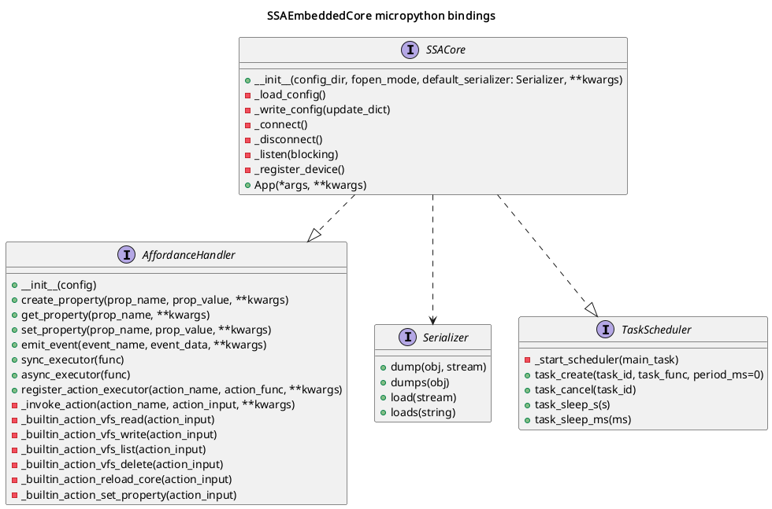

# SSAEmbeddedCore Micropython Bindings API Specification

## Overview
This document provides guidelines and a high-level API specification for the implementation of SSA Embedded Core runtimes in Micropython.
Runtimes implemented according to this specification should extend the [SSA Core Thing Model](https://github.com/dvalnn/SmartSensorActuator/blob/main/thing_models/ssa_core.tm.json)

## Contents
- [Overview](#overview)
- [Micropython API Interfaces](#micropython-api-interfaces)
  - [AffordanceHandler](#affordancehandler)
  - [Serializer](#serializer)
  - [TaskScheduler](#taskscheduler)
  - [SSACore](#ssacore)
- [Implementation Guidelines](#implementation-guidelines)
- [Configuration and Default Values](#configuration-and-default-values)
- [Additional Notes](#additional-notes)
- [Compliant Implementations](#compliant-implementations)
- [UML Diagrams](#uml-diagrams)

## Micropython API Interfaces

### AffordanceHandler
This interface provides the necessary functionality for handling a Thing's Interaction Affordances, which can be either user-defined or built-in.
Key responsibilities include property management, event emission, and action execution.

**Public Methods:**
- `create_property(prop_name, prop_value, **kwargs)`
- `get_property(prop_name, **kwargs)`
- `set_property(prop_name, prop_value, **kwargs)`
- `emit_event(event_name, event_data, **kwargs)`
- `sync_executor(func)` -> function decorator. Wraps synchronous task/action executors.
- `async_executor(func)` -> function decorator. Wraps asynchronous task/action executors.
- `register_action_executor(action_name, action_func, **kwargs)`

**Internal (Private) Methods:**
- `__init__(config)`

- `_invoke_action(action_name, action_input, **kwargs)`
- `_builtin_action_vfs_read(action_input)`
- `_builtin_action_vfs_write(action_input)`
- `_builtin_action_vfs_list(action_input)`
- `_builtin_action_vfs_delete(action_input)`
- `_builtin_action_reload_core(action_input)`
- `_builtin_action_set_property(action_input)` -> optional. Useful for runtimes that do not support request-response interactions with the Thing and need to set properties via actions (e.g., MQTT runtimes)

### Serializer
The `Serializer` interface standardizes the Python serialization API.
By default, it should utilize the built-in `json` module if no alternative is provided.
This interface exists to enable dependency injection in the `SSACore` implementation and allow for easy swapping of serialization libraries.

**Key Methods:**
- `dump(obj, stream)`
- `dumps(obj)`
- `load(stream)`
- `loads(string)`

### TaskScheduler
This interface enables the scheduling of both periodic and one-shot tasks within the runtime. It is particularly useful for sensor tasks and long-running asynchronous actions.

**Key Methods:**
- `task_create(task_id, task_func, period_ms=0)`
- `task_cancel(task_id)`
- `task_sleep_s(s)`
- `task_sleep_ms(ms)`

**Internal (Private) Method:**
- `_start_scheduler(main_task)`

### SSACore
The `SSACore` interface is the core of the Micropython implementation. It integrates the functionalities of both the `AffordanceHandler` and `TaskScheduler` interfaces and depends on the `Serializer` for data handling. The main entry point for user applications is provided via the `App` decorator.

**Key Methods:**
- `__init__(config_dir, fopen_mode, default_serializer: Serializer, **kwargs)`

**Internal (Private) Methods:**
- `_load_config()`
- `_write_config(update_dict)`
- `_connect()`
- `_disconnect()`
- `_listen(blocking)`
- `_register_device()`

**Public Method:**
- `App(*args, **kwargs)`

## Implementation Guidelines
- **Abstraction Layers:**  
  The system model is divided into:
  1. An implementation-agnostic overarching system model.
  2. Implementation-specific interfaces (such as these Micropython bindings).
  3. Concrete implementation documentation detailing specific language bindings.
  
- **Interface Inheritance:**  
  `SSACore` extends `AffordanceHandler` and `TaskScheduler` while also interacting with the `Serializer` interface.

- **Public vs. Private Methods:**  
  Public methods define the API available for application development, while private methods serve as internal implementation guidelines.

## Configuration and Default Values
- **`config_dir`:**  
  Defaults to `./config` if not provided.
- **`fopen_mode`:**  
  Defaults to `"text"` (implying "r/w" mode). Used to differentiate between plain-text and binary serialization.
- **`serializer`:**  
  Defaults to the built-in `json` module.
- Additional configuration can be passed via `*args` and `**kwargs`. Unused parameters should be ignored to maintain interoperability between different runtimes.

## Additional Notes
- The main entry point for runtime initialization is provided by the `App` decorator. For example:

  ```python
  @SSACore.App()
  def main(core: SSACore):
      # Extra configuration before runtime starts
      core.create_property(...)
      core.register_action_executor(...)
  ```

- The App entry point decorator should typically ensure the runtime is initialized and
a connection is established to the SSA network before executing the user-defined main and starting the runtime.

Typically, the `App` decorator should:
  1. Initialize the runtime instance.
  2. Load and validate local the configuration.
  3. Connect to the SSA network.
  4. Register the device.
  5. Wait for registration confirmation.
  6. Set up the core properties and actions.
  7. Execute the user-defined main function.
  8. Start the scheduler and listen for incoming requests.

## The SSA Bootloader
The SSA Bootloader is a separate utility from concrete runtime implementations. It depends on the SSACore interface and is responsible for loading the runtime and executing the main function.

Should the runtime instance initialized with the user-defined main function fail or exit unexpectedly, the SSA Bootloader falls back to an "empty" initialization, which only supports the runtimes' built-in affordances, as per the runtime thing model.

Micropython runtimes should adhere to this specification to ensure interoperability with the SSA Bootloader and compatibility with micropython applications developed for the SSA Embedded Core.

## Compliant implementations
Compliant implementations of this specification are added to this repository as submodules and their thing models are added to the [thing_models](https://github.com/dvalnn/SmartSensorActuator/tree/main/thing_models)/runtimes directory.

Currently, the only compliant implementation is the [SSA_uMQTTCore](https://github.com/dvalnn/SSA_uMQTTCore) runtime which uses the MQTT over WiFi for communication. This runtime was developed and tested using the Raspberry Pi Pico W board but should be compatible with other micropython boards with WiFi capabilities.

## UML Diagrams

### Interfaces class diagram

